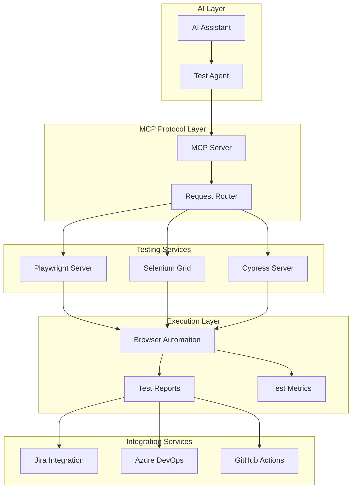
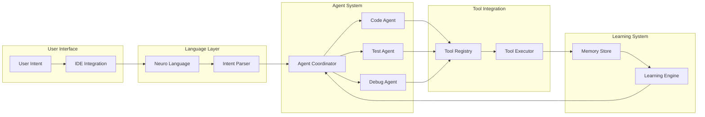
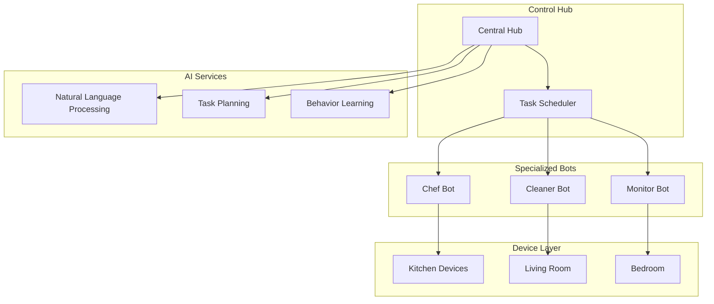

# 🏗️ System Architecture & Design Patterns

This document outlines the architectural patterns and system designs used across ElaMCB projects.

## 🔧 MCP Testing Ecosystem

### Overview
The MCP Testing Ecosystem bridges AI agents with testing tools through the Model Context Protocol, enabling autonomous test creation and execution.

### Architecture Diagram


### Key Components

#### MCP Server
- **Purpose**: Protocol translation layer
- **Technology**: TypeScript, Node.js
- **Responsibilities**:
  - Request routing
  - Protocol translation
  - Session management

#### Testing Servers
- **Playwright Server**: Primary browser automation
- **Selenium Grid**: Legacy and enterprise support
- **Cypress Server**: Frontend component testing

#### Integration Layer
- **Jira**: Test case and defect tracking
- **Azure DevOps**: CI/CD pipeline integration
- **GitHub Actions**: Automated workflows

---

## 🧠 AI Agent Architecture

### Overview
Multi-agent system architecture for AI-powered development tools.

### Architecture Diagram


### Design Patterns

#### Agent Pattern
- **Purpose**: Modular, specialized AI agents
- **Implementation**: Each agent handles specific domain
- **Benefits**: Scalability, maintainability, specialization

#### Coordinator Pattern
- **Purpose**: Orchestrates multi-agent collaboration
- **Implementation**: Central coordinator manages agent communication
- **Benefits**: Coordination, conflict resolution

#### Tool Registry Pattern
- **Purpose**: Dynamic tool discovery and registration
- **Implementation**: Plugin-based tool system
- **Benefits**: Extensibility, modularity

---

## 🏠 HouseBots Architecture

### Overview
Distributed home automation system with specialized bots.

### Architecture Diagram


### Key Patterns

#### Bot Pattern
- **Purpose**: Specialized autonomous agents
- **Implementation**: Each bot handles specific domain
- **Communication**: Message-based inter-bot communication

#### Hub Pattern
- **Purpose**: Centralized coordination
- **Implementation**: Central hub manages all bots
- **Benefits**: Unified control, resource sharing

---

## 🔐 Security Architecture

### Authentication & Authorization
- OAuth 2.0 for API access
- Role-based access control (RBAC)
- Token-based authentication

### Data Protection
- Encryption at rest and in transit
- Secure credential management
- Audit logging

---

## 📊 Scalability Patterns

### Horizontal Scaling
- Stateless service design
- Load balancing
- Distributed caching

### Vertical Scaling
- Resource optimization
- Performance tuning
- Efficient algorithms

---

## 🧪 Testing Architecture

### Test Pyramid
```
        /\
       /  \  E2E Tests (10%)
      /____\
     /      \  Integration Tests (30%)
    /________\
   /          \  Unit Tests (60%)
  /____________\
```

### Test Execution
- Parallel test execution
- Test isolation
- Deterministic test runs

---

*Architecture diagrams are updated as systems evolve. For specific implementation details, refer to individual project repositories.*

