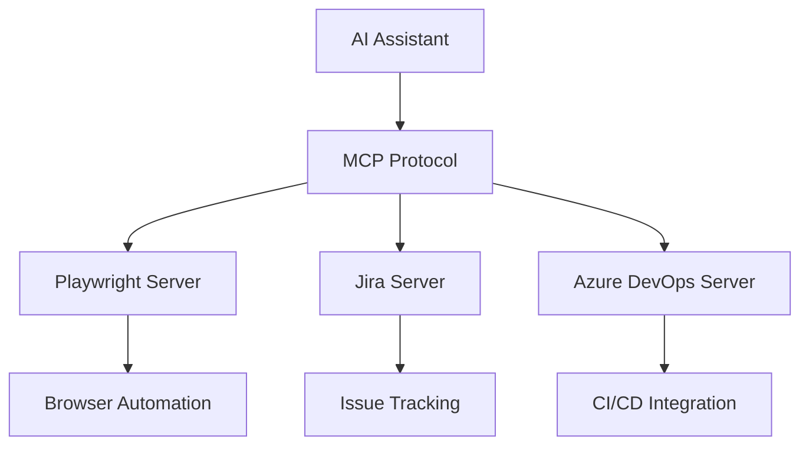
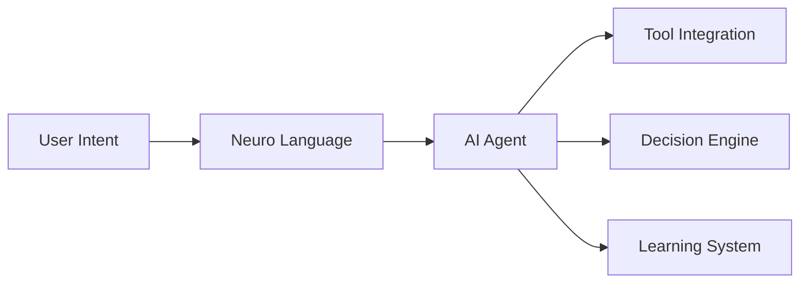
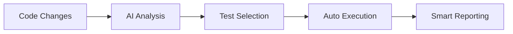
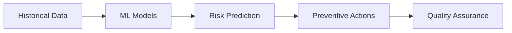

# ElaMCB's AI-Testing Universe


> **QA Lead specializing in AI-Powered Test Automation**  
> Transforming software quality through intelligent automation and cutting-edge AI

Welcome to my portfolio hub! This meta-repository showcases all my projects, from AI-powered testing infrastructure to practical automation solutions.

## AI-Testing Universe Overview

```mermaid
graph TD
    Root[ElaMCB's AI-Testing Universe] --> FP[Featured Projects]
    Root --> PC[Project Categories]
    Root --> CT[Core Technologies]
    
    FP --> MCP[MCP Testing Infrastructure]
    FP --> AI[AI Development Tools]
    FP --> PA[Practical AI Applications]
    
    MCP --> MCP1[-mcp-testing-servers<br/>Agentic testing servers for MCP-native IDEs<br/>Architecture: Bridge AI agents with testing tools<br/>Impact: Autonomous test creation & execution]
    
    AI --> AI1[LILIA<br/>VS Code extension with Agent Army]
    AI --> AI2[Neuro<br/>Intent-driven programming language for AI]
    AI --> AI3[AI-Ethica<br/>Ethical AI evaluation framework]
    
    PA --> PA1[Ela-s-HouseBots<br/>Domestic automation - Chef Bot, Cleaner Bot]
    PA --> PA2[virtual-recruiter-reply-bot_ARIA<br/>AI recruiter response automation]
    
    PC --> PC1[Testing & QA<br/>5 repos: Playwright, TypeScript, MCP]
    PC --> PC2[AI/ML Frameworks<br/>8 repos: Python, TensorFlow, PyTorch]
    PC --> PC3[Development Tools<br/>4 repos: VS Code, Language Design]
    PC --> PC4[Enterprise AI<br/>3 repos: RAG, Automation]
    PC --> PC5[Personal Projects<br/>6 repos: Home automation, Games]
    PC --> PC6[Research<br/>3 repos: Papers, POCs]
    
    CT --> CT1[Testing<br/>Playwright, Selenium, Cypress, MCP]
    CT --> CT2[AI/ML<br/>Python, TensorFlow, PyTorch, Ollama]
    CT --> CT3[Languages<br/>TypeScript, Python, JavaScript, Neuro]
    CT --> CT4[Tools<br/>VS Code, GitHub Actions, Docker]
```



## Featured Projects

### MCP Testing Infrastructure
- **[-mcp-testing-servers](https://github.com/ElaMCB/-mcp-testing-servers)** - Agentic testing servers for MCP-native IDEs
- **Architecture**: Bridge AI agents with testing tools using Model Context Protocol
- **Impact**: Enables autonomous test creation, execution, and maintenance

### AI Development Tools
- **[LILIA](https://github.com/ElaMCB/LILIA)** - VS Code extension with Agent Army
- **[Neuro](https://github.com/ElaMCB/Neuro)** - Intent-driven programming language for AI
- **[AI-Ethica](https://github.com/ElaMCB/AI-Ethica)** - Ethical AI evaluation framework

### Practical AI Applications
- **[Ela-s-HouseBots](https://github.com/ElaMCB/Ela-s-HouseBots)** - Domestic automation (Chef Bot, Cleaner Bot)
- **[virtual-recruiter-reply-bot_ARIA](https://github.com/ElaMCB/virtual-recruiter-reply-bot_ARIA)** - AI recruiter response automation

## Project Categories

| Category | Projects | Technologies |
|----------|----------|--------------|
| **Testing & QA** | 5 repos | Playwright, TypeScript, MCP |
| **AI/ML Frameworks** | 8 repos | Python, TensorFlow, PyTorch |
| **Development Tools** | 4 repos | VS Code, Language Design |
| **Enterprise AI** | 3 repos | RAG, Automation |
| **Personal Projects** | 6 repos | Home automation, Games |
| **Research** | 3 repos | Papers, POCs |

## Core Technologies

```text
Testing: Playwright, Selenium, Cypress, MCP
AI/ML: Python, TensorFlow, PyTorch, Ollama
Languages: TypeScript, Python, JavaScript, Neuro
Tools: VS Code, GitHub Actions, Docker
```

## Innovation Technologies


## Advanced Testing Capabilities


## Architecture Highlights

### MCP Testing Ecosystem



### AI Agent Architecture




## Innovation Pipeline

### Phase 1: Autonomous Testing (Current)



### Phase 2: Predictive Quality (Next)



## Research Excellence


Our GitHub-native research methodology pioneers new approaches to AI-powered testing, focusing on reproducibility, open science, and measurable innovation.

### Research Focus Areas

**1. Zero-Maintenance Testing**
- **Goal**: 80% reduction in test maintenance effort
- **Approach**: AI-driven selector adaptation and self-healing tests
- **Timeline**: Q1 2026

**2. Ethical AI Validation**
- **Goal**: Automated bias detection in AI applications
- **Approach**: Expand AI-Ethica framework with production monitoring
- **Timeline**: Q2 2026

**3. Predictive Defect Prevention**
- **Goal**: 85% accuracy in predicting failure hotspots
- **Approach**: ML models analyzing code patterns and user behavior
- **Timeline**: Q3 2026

## Impact Metrics


## Project Status

| Project                 | Status        | Last Updated | Language   | Focus Area      |
| ----------------------- | ------------- | ------------ | ---------- | --------------- |
| **MCP Testing Servers** | 🟢 Active     | Oct 2025     | TypeScript | Agentic Testing |
| **LILIA**               | 🟢 Active     | Last week    | TypeScript | AI IDE Tools    |
| **AI-Ethica**           | 🟢 Active     | 2 days ago   | Python     | Ethical AI      |
| **Neuro**               | 🟡 Maintained | Nov 2025     | Python     | AI Language     |
| **HouseBots**           | 🟡 Maintained | Aug 2025     | Python     | Home Automation |

## Getting Started

### Quick Start
- **Explore MCP Testing**: Start with [-mcp-testing-servers](https://github.com/ElaMCB/-mcp-testing-servers)
- **Try LILIA**: Experience AI-powered development
- **Read the Research**: Check out [AI-Ethica](https://github.com/ElaMCB/AI-Ethica)

### Development Setup
```bash
# Clone this meta-repo
git clone https://github.com/ElaMCB/ElaMCB-Portfolio-Hub.git

# Explore individual projects
cd ElaMCB-Portfolio-Hub
./scripts/explore-projects.sh
```

## Documentation

- [Detailed Project Descriptions](PROJECTS.md) - Complete overview of all projects
- [Technology Stack](TECHNOLOGIES.md) - Deep dive into technologies used
- [Architecture Guide](ARCHITECTURE.md) - System designs and patterns
- [Live Demos](DEMOS.md) - Try projects in action

## Contributing

Interested in contributing? Check out our [Contributing Guide](CONTRIBUTING.md) and:
- **Issues**: Report bugs or request features
- **Discussions**: Share ideas and ask questions
- **Pull Requests**: Submit improvements

## Connect & Collaborate

- [Portfolio Website](https://elamcb.github.io)
- [Research Blog](https://elamcb.github.io/research)
- [GitHub Profile](https://github.com/ElaMCB)

### Professional Focus
- **Role**: QA Lead - AI-Powered Test Automation
- **Expertise**: Playwright, TypeScript, Python, MCP
- **Mission**: Transforming software quality through intelligent automation

---

## Quality Assurance & Community


**Explore** | **Collaborate** | **Innovate**
