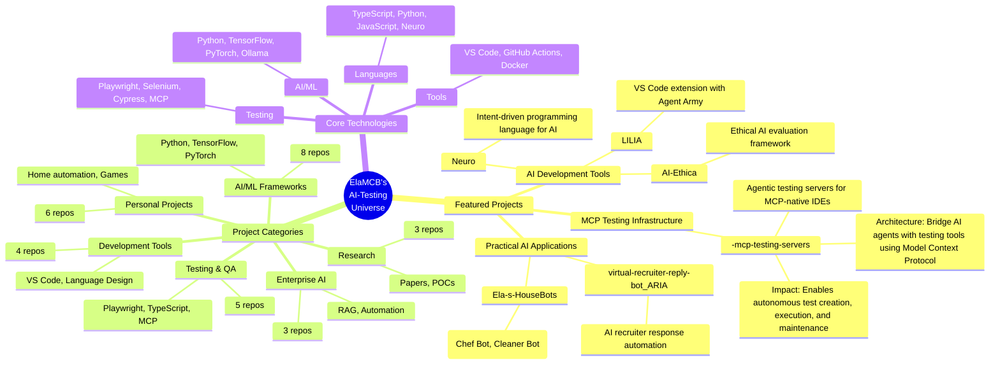
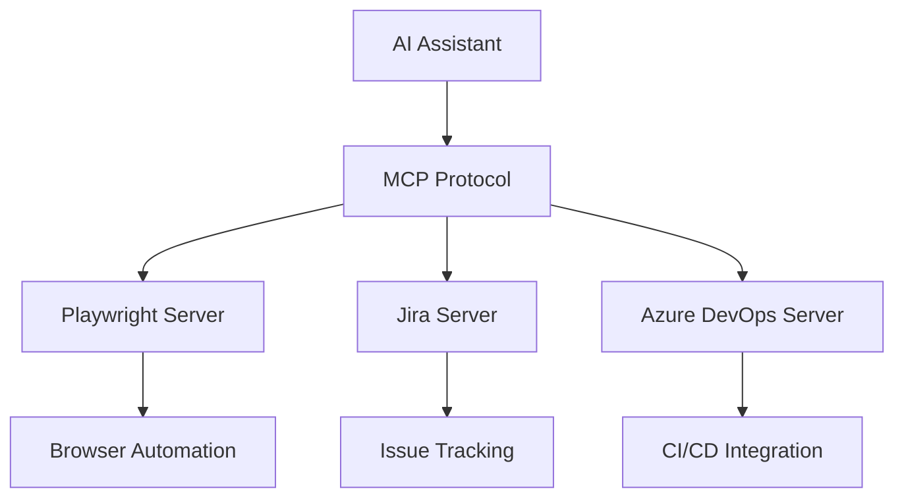
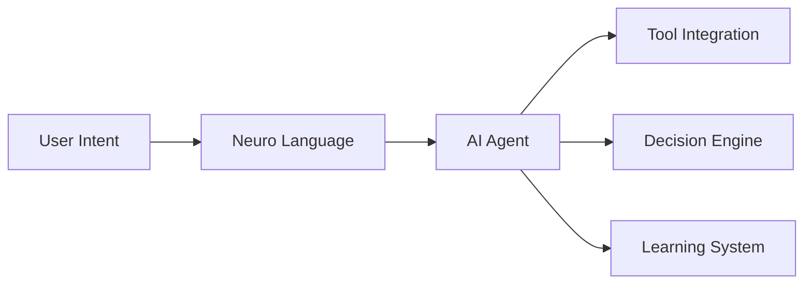

# ElaMCB's AI-Testing Universe

[](https://elamcb.github.io)
[](https://github.com/ElaMCB/-mcp-testing-servers)
[](https://github.com/ElaMCB/playwright-inventory-tests)
[](https://github.com/ElaMCB?tab=repositories)

> **QA Lead specializing in AI-Powered Test Automation**  
> Transforming software quality through intelligent automation and cutting-edge AI

Welcome to my portfolio hub! This meta-repository showcases all my projects, from AI-powered testing infrastructure to practical automation solutions.

## AI-Testing Universe Overview



## Featured Projects

### MCP Testing Infrastructure
- **[-mcp-testing-servers](https://github.com/ElaMCB/-mcp-testing-servers)** - Agentic testing servers for MCP-native IDEs
- **Architecture**: Bridge AI agents with testing tools using Model Context Protocol
- **Impact**: Enables autonomous test creation, execution, and maintenance

### AI Development Tools
- **[LILIA](https://github.com/ElaMCB/LILIA)** - VS Code extension with Agent Army
- **[Neuro](https://github.com/ElaMCB/Neuro)** - Intent-driven programming language for AI
- **[AI-Ethica](https://github.com/ElaMCB/AI-Ethica)** - Ethical AI evaluation framework

### Practical AI Applications
- **[Ela-s-HouseBots](https://github.com/ElaMCB/Ela-s-HouseBots)** - Domestic automation (Chef Bot, Cleaner Bot)
- **[virtual-recruiter-reply-bot_ARIA](https://github.com/ElaMCB/virtual-recruiter-reply-bot_ARIA)** - AI recruiter response automation

## Project Categories

| Category | Projects | Technologies |
|----------|----------|--------------|
| **Testing & QA** | 5 repos | Playwright, TypeScript, MCP |
| **AI/ML Frameworks** | 8 repos | Python, TensorFlow, PyTorch |
| **Development Tools** | 4 repos | VS Code, Language Design |
| **Enterprise AI** | 3 repos | RAG, Automation |
| **Personal Projects** | 6 repos | Home automation, Games |
| **Research** | 3 repos | Papers, POCs |

## Core Technologies

```text
Testing: Playwright, Selenium, Cypress, MCP
AI/ML: Python, TensorFlow, PyTorch, Ollama
Languages: TypeScript, Python, JavaScript, Neuro
Tools: VS Code, GitHub Actions, Docker
```

## Architecture Highlights

### MCP Testing Ecosystem



### AI Agent Architecture



## Project Status

| Project | Status | Last Updated | Language | Stars |
|---------|--------|--------------|----------|-------|
| MCP Testing Servers | Active | Oct 2025 | TypeScript | 2 |
| LILIA | Active | Last week | TypeScript | - |
| AI-Ethica | Active | 2 days ago | Python | - |
| Neuro | Maintained | Nov 2025 | Python | 2 |
| HouseBots | Maintained | Aug 2025 | Python | 1 |

## Getting Started

### Quick Start
- **Explore MCP Testing**: Start with [-mcp-testing-servers](https://github.com/ElaMCB/-mcp-testing-servers)
- **Try LILIA**: Experience AI-powered development
- **Read the Research**: Check out [AI-Ethica](https://github.com/ElaMCB/AI-Ethica)

### Development Setup
```bash
# Clone this meta-repo
git clone https://github.com/ElaMCB/ElaMCB-Portfolio-Hub.git

# Explore individual projects
cd ElaMCB-Portfolio-Hub
./scripts/explore-projects.sh
```

## Documentation

- [Detailed Project Descriptions](PROJECTS.md) - Complete overview of all projects
- [Technology Stack](TECHNOLOGIES.md) - Deep dive into technologies used
- [Architecture Guide](ARCHITECTURE.md) - System designs and patterns
- [Live Demos](DEMOS.md) - Try projects in action

## Contributing

Interested in contributing? Check out our [Contributing Guide](CONTRIBUTING.md) and:
- **Issues**: Report bugs or request features
- **Discussions**: Share ideas and ask questions
- **Pull Requests**: Submit improvements

## Connect & Collaborate

- [Portfolio Website](https://elamcb.github.io)
- [Research Blog](https://elamcb.github.io/research)
- [GitHub Profile](https://github.com/ElaMCB)

### Professional Focus
- **Role**: QA Lead - AI-Powered Test Automation
- **Expertise**: Playwright, TypeScript, Python, MCP
- **Mission**: Transforming software quality through intelligent automation

---

**Explore** | **Collaborate** | **Innovate**
